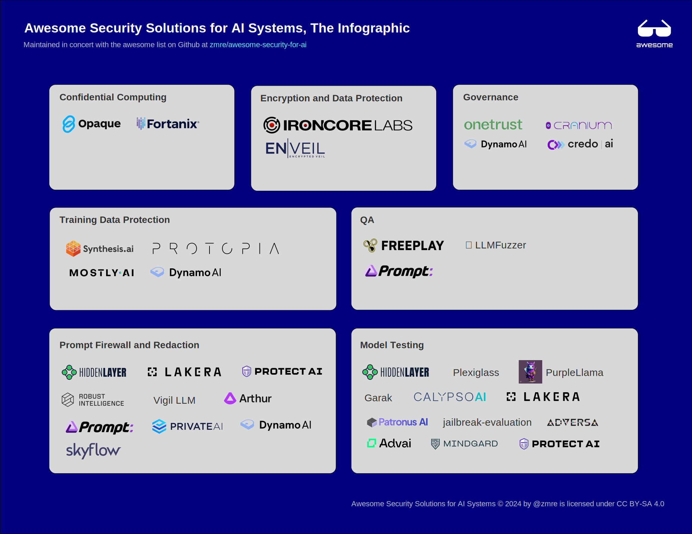

# Awesome Security Solutions for AI Systems 

> A curated list of solutions that secure GenAI systems and LLMs

## Intro

A curated list of awesome solutions to hard AI security problems and risks.  This stands in contrast to using AI for security (for offense or defense) and is explicitly meant to link to software and solutions that help solve the problems

Other lists cover the many excellent frameworks, papers, attacks, safety, and so forth.  But new GenAI systems are subject to all new classes of attacks and it has been difficult to find projects and companies that solve these problems as they rarely shine through the noise of "AI security" as a phrase.

If you want to contribute, create a PR.

### Related awesome lists

- [ottosulin/awesome-ai-security](https://github.com/ottosulin/awesome-ai-security) - AI security related frameworks, attacks, tools and papers.
- [deepspaceharbor/awesome-ai-security](https://github.com/DeepSpaceHarbor/Awesome-AI-Security) - AI security resources including attacks, examples, and code.
- [awesome-ai-for-cybersecurity](https://github.com/Billy1900/Awesome-AI-for-cybersecurity) - Research roundup on AI's use in classic security tools.
- [awesome-llm-security](https://github.com/corca-ai/awesome-llm-security) - A curation of awesome tools, documents and projects about LLM Security.
- [awesome-ml-privacy-attacks](https://github.com/stratosphereips/awesome-ml-privacy-attacks) - An awesome list of papers on privacy attacks against machine learning.
- [awesome-ml-security](https://github.com/trailofbits/awesome-ml-security) - Trail of Bits' machine learning security references, guidance, and tools.

### Infographic summary

As an experiment, we'll try to keep an [infographic of awesome ai security solutions](awesome-ai-security-infographic.svg) up-to-date as an open source SVG file. This will be a fast visual overview with a mix of logos and text.

### Contents

- [Confidential Computing](#confidential-computing)
- [Encryption and Data Protection](#encryption-and-data-protection)
- [Governance](#governance)
- [Model Testing](#model-testing)
- [Prompt Firewall and Redaction](#prompt-firewall-and-redaction)
- [QA](#qa)
- [Training Data Protection](#training-data-protection)
- [Contributing](#contributing)

---

## Confidential Computing

_Solutions that use secure enclaves and confidential computing to keep the data in parts of AI workflows private._

- [Fortanix Confidential AI](https://www.fortanix.com/platform/confidential-ai) - Run AI models inside Intel SGX and other enclave technologies.

<!--
- [Opaque Systems](https://opaque.co/) - Run models in confidential compute environments

Leave here as a reminder. It seems Opaque has removed their confidential compute AI product and now has a product called Opaque Gateway that redacts and "compresses" prompts before sending on to OpenAI et al. But the product is in "waitlist" state as of May 2024 and so isn't eligible for this list. https://opaquegateway.opaque.co/

Leaving this here since they've now raised US$31M and have at least one rockstar founder, plus they were born out of a nice open source product: https://github.com/mc2-project/mc2,  so worth checking status again in awhile.
-->

## Encryption and Data Protection

_Products that protect AI data privacy by encrypting the data. Infrastructure-layer encryption like filesystem encryption do not belong here. Only application-layer encryption solutions are eligible._

- [IronCore Labs' Cloaked AI](https://ironcorelabs.com/products/cloaked-ai/) - Encrypt vector embeddings before sending to a vector database to secure the data in RAG workflows and other AI workflows. 

- [Enveil Secure AI](https://www.enveil.com/secure-ai/) - Train encrypted models and do encrypted inferences over them.

## Governance

_Products that specifically track AI projects and produce reports to meet various AI and privacy regulations and/or frameworks._

- [OneTrust AI Governance](https://www.onetrust.com/products/ai-governance/) - Track projects and apply frameworks to them.
- [Cranium AI Exposure Management Solution](https://www.cranium.ai) - Provide visibility into an AI system, characterize attack surfaces, and assess vulnerabilities in an organization.
- [CredoAI](https://www.credo.ai) - AI governance, risk, and compliance for the AI-powered enterprise.
- [DynamoEval](https://dynamo.ai/platform/dynamoeval) - Provides automated stress testing of AI systems and autogenerates documentation needed for regulatory audits.

## Model Testing

_Products that examine or test models for security issues of various kinds._

- [HiddenLayer Model Scanner](https://hiddenlayer.com/model-scanner/) - Scan models for vulnerabilities and supply chain issues.
- [Plexiglass](https://github.com/kortex-labs/plexiglass) - A toolkit for detecting and protecting against vulnerabilities in Large Language Models (LLMs). 
- [PurpleLlama](https://github.com/facebookresearch/PurpleLlama) - Set of tools from Meta to assess and improve LLM security. 
- [Garak](https://garak.ai/) - A LLM vulnerability scanner. 
- [CalypsoAI Platform](https://calypsoai.com/platform/) - Platform for testing and launching LLM applications securely.
- [Lakera Red](https://www.lakera.ai/ai-red-teaming) - Automated safety and security assessments for your GenAI applications.
- [jailbreak-evaluation](https://github.com/controllability/jailbreak-evaluation) - Python package for language model jailbreak evaluation. 
- [Patronus AI](https://www.patronus.ai) - Automated testing of models to detect PII, copyrighted materials, and sensitive information in models.
- [Adversa Red Teaming](https://adversa.ai/ai-red-teaming-llm/) - Continuous AI red teaming for LLMs.
- [Advai](https://www.advai.co.uk) - Automates the tasks of stress-testing, red-teaming, and evaluating your AI systems for critical failure.
- [Mindgard AI](https://mindgard.ai) - Identifies and remediates risks across AI models, GenAI, LLMs along with AI-powered apps and chatbots.
- [Protect AI ModelScan](https://protectai.com/modelscan) - Scan models for serialization attacks. 
- [Protect AI Guardian](https://protectai.com/guardian) - Scan models for security issues or policy violations with auditing and reporting.

## Prompt Firewall and Redaction

_Products that intercept prompts and responses and apply security or privacy rules to them. We've blended two categories here because some prompt firewalls just redact private data (and then reidentify in the response) while others focus on identifying and blocking attacks like injection attacks or stopping data leaks. Many of the products in this category do all of the above, which is why they've been combined._

- [Protect AI Rebuff](https://playground.rebuff.ai) - A LLM prompt injection detector. 
- [Protect AI LLM Guard](https://protectai.com/llm-guard) - Suite of tools to protect LLM applications by helping you detect, redact, and sanitize LLM prompts and responses. 
- [HiddenLayer AI Detection and Response](https://hiddenlayer.com/aidr/) - Proactively defend against threats to your LLMs.
- [Robust Intelligence AI Firewall](https://www.robustintelligence.com/platform/ai-firewall-guardrails) - Real-time protection, automatically configured to address the vulnerabilities of each model.
- [Vigil LLM](https://github.com/deadbits/vigil-llm) - Detect prompt injections, jailbreaks, and other potentially risky Large Language Model (LLM) inputs. 
- [Lakera Guard](https://www.lakera.ai/lakera-guard) - Protection from prompt injections, data loss, and toxic content.
- [Arthur Shield](https://www.arthur.ai/product/shield) - Built-in, real-time firewall protection against the biggest LLM risks.
- [Prompt Security](https://www.prompt.security) - SDK and proxy for protection against common prompt attacks.
- [Private AI](https://www.private-ai.com) - Detect, anonymize, and replace PII with less than half the error rate of alternatives.
- [DynamoGuard](https://dynamo.ai/platform/dynamoguard) - Identify / defend against any type of non-compliance as defined by your specific AI policies and catch attacks.
- [Skyflow LLM Privacy Vault](https://www.skyflow.com/product/llm-privacy-vault) - Redacts PII from prompts flowing to LLMs.
- [Guardrails AI](https://www.guardrailsai.com) - Guardrails runs Input/Output Guards in your application that detect, quantify and mitigate the presence of specific types of risks. 

## QA

_Products that add quality controls and testing for GenAI workflows other than express testing of models. These tend to focus more on prompts and APIs._

- [Freeplay AI](https://freeplay.ai) - Test and track prompts, their performance and versions over time.
- [Prompt Security Fuzzer](https://www.prompt.security/fuzzer) - Open-source tool to help you harden your GenAI applications. 
- [LLMFuzzer](https://github.com/mnns/LLMFuzzer) - Open-source fuzzing framework specifically designed for LLMs, especially for their integrations in applications via APIs. 

## Training Data Protection

_Products that specifically address private data in the training of models and sometimes also in prompts to models that have been trained using their protections._

- [Synthesis AI](https://synthesis.ai) - Simulation and synthetic data for computer vision training.
- [Protopia AI](https://protopia.ai) - "Stained glass transforms" of text and image data when training preserves privacy in model and inferences.
- [Mostly AI](https://mostly.ai) - Use existing data and the power of Generative AI for synthetic data generation.
- [DynamoEnhance](https://dynamo.ai/platform/dynamoenhance) - Use differential privacy and PII sanitization on training data.

<!-- 

## To review

- [Bosch AIShield](https://www.boschaishield.com) - I can't figure out what this actually does or where to put it

-->

---

## Project Details
### Contributing

Contributions are welcome.  Add new items, suggest changes to categories or descriptions, etc. We're not aiming to be comprehensive, but to provide a short list of the most notable solutions in each category.

That said, there are some rules as there is an established format and approach. Please carefully read the [guidelines for contributing in the `contributing.md`](./contributing.md) file in this repo.

